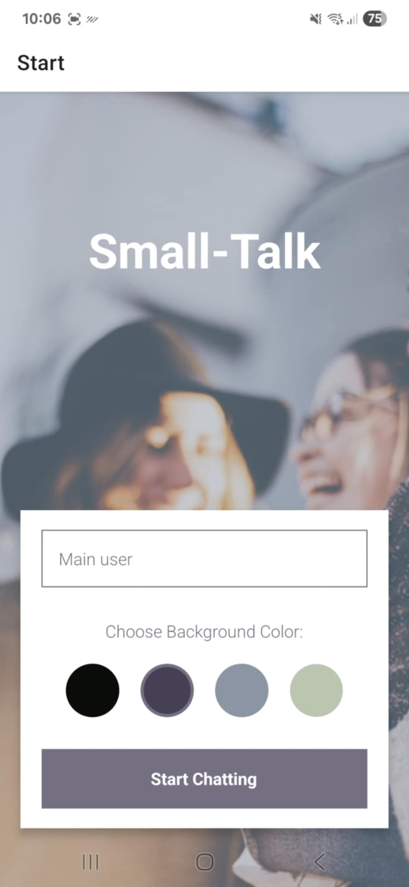
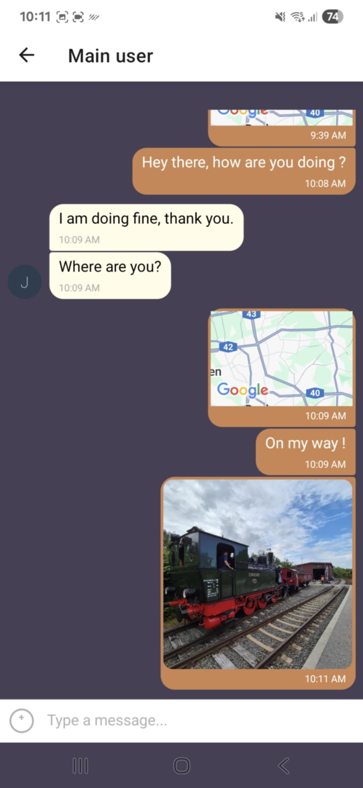

# Small-Talk

Small-Talk is a React Native chat application built with Expo and Google Firebase.
The app allows users to chat in real time, share images, and send their location. It also supports offline functionality by caching messages locally and syncing back to Firebase when connectivity is restored.

## Features

- Anonymous authentication with Firebase Auth

- Real-time chat powered by Firestore

- Image sharing via Firebase Storage

- Location sharing using Expo Location and React Native Maps

- Offline support with AsyncStorage (messages cached locally)

- Full-screen image viewer with zoom support

- Customizable chat background color on start screen

- Network connection monitoring to handle offline/online transitions

## Requirements

- Node.js v20.11.1 (recommended)

- npm (comes with Node)

- Expo Go app on your mobile device (for testing)

## Tech Stack

- React Native (via Expo SDK 54)

- Firebase (Auth, Firestore, Storage)

- React Navigation for screen navigation

- Gifted Chat for chat UI

- Expo Location & Expo Image Picker

- AsyncStorage for offline persistence

## Installation

1. Clone this repository:

```bash
git clone https://github.com/LambicJaune/small-talk
cd small-talk
```

2. Install dependencies:

```bash
npm install
```

3. Start the app:

```bash
npm start
```

If using Expo directly:

```bash
npx expo start
```

If running directly on devices (or emulators):

For Android:

```bash
npm run android
```

For iOS:

```bash
npm run ios
```

You can also scan the QR cose with the Expo Go app on your device to preview the app.

## Firebase Setup

To use Firebase with this app, you need to set up a Firebase project and configure the credentials in your App.js file.

Go to the Firebase Console.

Create a new Firebase project.

Enable:

- Authentication (Anonymous Sign-In)

- Cloud Firestore

- Firebase Storage

- Replace the firebaseConfig object inside App.js with your own Firebase configuration.

## Dependencies

Main libraries used in this project:

- firebase – Firestore, Auth, Storage

- @react-navigation/native & @react-navigation/native-stack – navigation between the different screens

- react-native-gifted-chat – chat UI

- expo-image-picker – select or take photos

- expo-location – share current location

- react-native-maps – display shared locations

- @react-native-community/netinfo – network monitoring

- @react-native-async-storage/async-storage – offline caching

- react-native-image-zoom-viewer – fullscreen image preview

- @expo/react-native-action-sheet – action sheet for media/location options


## Small-Talk visuals

<p align="center">
  
  
</p>

